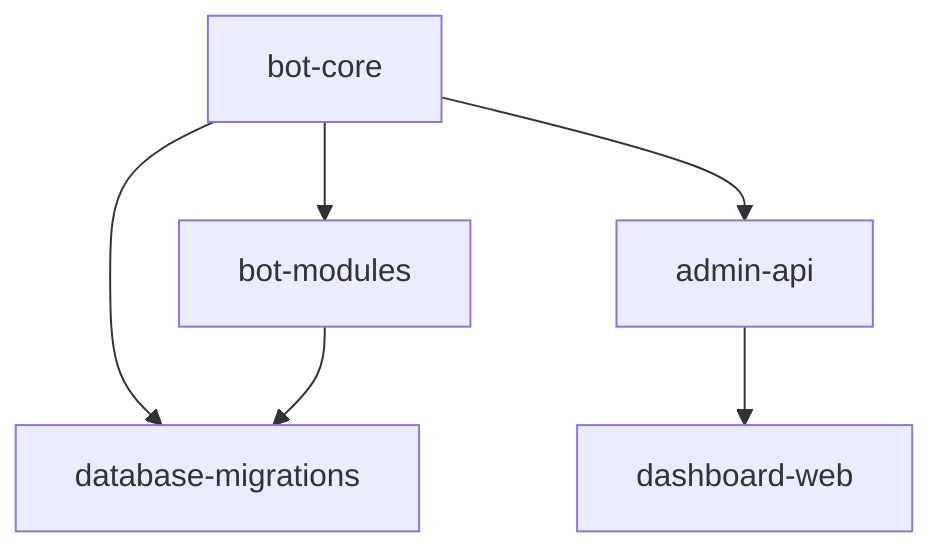

# Enterprise Telegram Group Management Bot
## Respect-Like Full Featured Bot (v1.2)

[](LICENSE)
[](https://python.org)
[](https://docs.pyrogram.org)

---

## 📋 Overview

Enterprise-grade Telegram group management bot with **200+ modular features**, **bilingual UI (Persian/English)**, **SUDO-gated security**, and **glass panel interface**.

### Key Features
- 🔐 **SUDO-Gated Installation** - Unauthorized installs immediately rejected
- 🌐 **Bilingual UI** - Persian (fa) + English (en) support
- 🎛️ **Glass Panel Interface** - All features accessible via inline keyboards
- 👥 **Advanced Role System** - SUDO / Owner / Admin / VIP / Member
- 📊 **Join Tracking** - Track how users joined, who added them, invite links
- 🛡️ **Anti-Ad System** - BIO scan + account age verification
- ✅ **Verification Gate** - DM code verification before entry
- 🚫 **VIP Immunity** - Protected users with special privileges
- 📈 **Daily Reports** - Automated group statistics and activity
- 🔍 **Full Audit Logs** - Every action tracked and logged

---

## 🏗️ Architecture

This project is organized as a **mono-repository** with 6 distinct modules:

```
telegram-group-bot/
├── bot-core/              # Main bot service (handlers, routing, auth)
├── bot-modules/           # Feature modules (200+ options)
├── admin-api/             # REST API for management
├── dashboard-web/         # Web dashboard for SUDO
├── database-migrations/   # Schema migrations & seeds
└── docs/                  # Full documentation
```

### Module Dependencies


---

## 🚀 Quick Start

### Prerequisites
- Python 3.10+
- MongoDB 5.0+
- Telegram Bot Token (from @BotFather)
- API_ID & API_HASH (from my.telegram.org)

### Installation

```bash
# Clone repository
git clone https://github.com/yourorg/telegram-group-bot.git
cd telegram-group-bot

# Install dependencies
pip install -r requirements.txt

# Setup environment
cp .env.example .env
# Edit .env with your credentials

# Run database migrations
cd database-migrations
python migrate.py

# Start bot
cd ../bot-core
python main.py
```

### Docker Deployment

```bash
docker-compose up -d
```

---

## 📖 Repository Breakdown

### 1️⃣ bot-core
**Main bot service** - Event handlers, command routing, authentication

**Key Components:**
- `handlers/` - Message, callback, join/leave event handlers
- `middlewares/` - Auth, rate limiting, logging
- `routers/` - Command and panel routing
- `i18n/` - Persian (fa) + English (en) translations
- `services/` - Role enforcement, group activation gate

**Technologies:** Pyrogram, Motor (async MongoDB), APScheduler

---

### 2️⃣ bot-modules
**Modular feature packages** - 200+ togglable options

**Modules:**
- `moderation/` - ban, kick, mute, warn, purge (40+ options)
- `anti_spam/` - antilink, antiforward, content filters (30+ options)
- `locks/` - lock media types, mentions, polls (25+ options)
- `join_tracking/` - who_added, invite_tree, link tracking (15+ options)
- `verification/` - rverify, captcha, code verification (10+ options)
- `reports/` - gpstatus, daily reports, stats (20+ options)
- `logs/` - audit logs, action tracking (15+ options)
- `vip_roles/` - setvip, promote, apanel, upanel (25+ options)
- `antibetra/` - rantibetra, ban limits, betrayal detection (10+ options)
- `cleanup/` - clean fakes, inactive users (10+ options)
- `media_vc/` (Phase 2) - voice chat, media playback (20+ options)

**Each module exports:**
```python
{
    "commands": [...],
    "panels": [...],
    "config_schema": {...},
    "i18n_keys": [...]
}
```

---

### 3️⃣ admin-api
**REST API** for external integrations and dashboard

**Endpoints:**
- `POST /api/groups/approve` - Approve group activation
- `GET /api/groups/{id}/stats` - Get group statistics
- `POST /api/users/sudo` - Manage SUDO users
- `GET /api/logs` - Query audit logs

**Auth:** JWT tokens (SUDO level + per-group tokens)

**Tech Stack:** FastAPI, Pydantic, Motor

---

### 4️⃣ dashboard-web
**Web dashboard** for SUDO management

**Features:**
- 📊 View all groups (approved/pending)
- ✅ Approve/revoke group activation
- 📈 Global statistics dashboard
- 🔍 Search logs across all groups
- 💳 Billing & subscription management (optional)

**Tech Stack:** Next.js, TailwindCSS, React Query

**Languages:** Bilingual (fa/en)

---

### 5️⃣ database-migrations
**Database schema management**

**Contents:**
- `migrations/` - Sequential migration scripts
- `seeds/` - Initial data (default settings, permissions)
- `backups/` - Backup procedures and restore scripts

**Collections:**
- `users` - User profiles, SUDO flags
- `groups` - Group settings, owner, language, approved status
- `group_users` - User roles, VIP, warns, join data
- `admin_defaults` - Default bot permissions (apanel)
- `admin_overrides` - Per-admin permission overrides (upanel)
- `invite_links` - Tracked invite links with tags
- `logs` - Audit trail of all actions
- `settings` - Per-module configuration

---

### 6️⃣ docs
**Complete documentation**

**Contents:**
- `commands.md` - All commands (English) with examples
- `ui_strings.md` - Persian UI text reference
- `panels.md` - Panel screenshots and flows
- `deployment.md` - Docker, Kubernetes, cloud deployment
- `feature_matrix.md` - **200+ options** with keys and defaults
- `api_reference.md` - REST API documentation

---

## 🔑 Core Concepts

### Role System (Internal + Telegram)

| Role | Level | Capabilities |
|------|-------|--------------|
| **SUDO** | System-wide | Approve groups, manage all groups, system config |
| **GROUP_OWNER** | Per-group | Full control within group, promote admins, set VIP |
| **BOT_ADMIN** | Per-group | Execute moderation (based on permissions) |
| **VIP** | Per-group | Immune to auto-moderation, requires demvip before ban |
| **MEMBER** | Default | Regular user |

### Permission Templates

**APANEL (Default Template)**
- Set default bot permissions for ALL newly promoted admins
- Managed by GROUP_OWNER only
- Applied automatically on `promoteadmin`

**UPANEL (Per-Admin Override)**
- Override permissions for specific admin
- Takes precedence over APANEL defaults
- Can reset to APANEL defaults

---

## 🔒 Security Features

### SUDO-Gated Installation
```
Bot added to group
    ↓
Approved? NO → Send warning + support button → LEAVE immediately
    ↓
Approved? YES → Load modules → Activate features
```

### VIP Protection
```
Action: ban @vip_user
    ↓
Check VIP status → YES → REFUSE + show message "Remove VIP first (demvip)"
    ↓
VIP status → NO → Execute ban
```

### Join Tracking Data
Every user join stores:
- `join_method`: invite_link / added_by_user / join_request / unknown
- `added_by`: user_id (if manually added)
- `invite_link_id` + `invite_link_tag` (if via invite link)
- `join_time`: timestamp

**Commands:**
- `who_added` - Show how user joined
- `invite_tree` - Show who this user added
- `added_list` - List users added by replied user

---

## 🌐 Bilingual Support (fa/en)

### Language Setting
```python
# Per-group language
/lang fa  # Set Persian
/lang en  # Set English
```

### Implementation
```python
# i18n/fa.json
{
    "unauthorized_install": "این ربات بدون مجوز به گروه اضافه شده است.",
    "contact_support": "تماس با پشتیبانی",
    "vip_ban_blocked": "این کاربر VIP است. ابتدا VIP را بردارید."
}

# i18n/en.json
{
    "unauthorized_install": "Unauthorized installation. Contact support.",
    "contact_support": "Contact Support",
    "vip_ban_blocked": "User is VIP. Remove VIP first using demvip."
}
```

**Commands:** Always English
**UI/Responses:** Language-aware (fa/en)

---

## 📊 Feature Matrix (200+ Options)

See [docs/feature_matrix.md](docs/feature_matrix.md) for complete list.

### Sample Features by Category

**Moderation (40+)**
- ban, unban, kick, mute, unmute, warn, unwarn, restrict, purge, del, pin, lockdown, slowmode...

**Anti-Spam (30+)**
- antilink, antiforward, lock photo/video/gif/sticker/voice/audio/document/poll/location/contact...

**Join Tracking (15+)**
- track_join, who_added, invite_tree, added_list, link_list, link_tag...

**Verification (10+)**
- rverify, verify_type, verify_timeout, verify_attempts, verify_fail_action...

**Reports (20+)**
- gpstatus, active admins/users, join/leave lists, suspicious users...

**VIP/Roles (25+)**
- setvip, demvip, viplist, promote, demote, promoteadmin, demoteadmin, apanel, upanel...

**Anti-Betrayal (10+)**
- rantibetra, setmaxban, setmaxbantime...

**Cleanup (10+)**
- clean fakes, clean_inactive_days, clean_preview, clean_execute...

**Logs (15+)**
- log on/off, setlogchat, logs panel, action tracking...

**Settings (25+)**
- panel, panel_lock, lang, auth_mode, bind_owner_button...

---

## 🧪 Testing

### Acceptance Tests (Must Pass)

1. ✅ **Unauthorized install** → message + support button → immediate leave
2. ✅ **approve_group** → bot becomes active
3. ✅ **setowner** works; only authorized can run
4. ✅ **promoteadmin** opens panel; Telegram rights applied correctly
5. ✅ **apanel** defaults apply to new admins
6. ✅ **upanel** overrides only affect specific admin
7. ✅ **VIP immunity:** no auto punishment; ban refused until demvip
8. ✅ **who_added** returns method and who added
9. ✅ **invite_tree/added_list** returns who user added (paginated)
10. ✅ **Bilingual UI:** fa/en responses; commands remain EN

### Run Tests
```bash
cd bot-core
pytest tests/ -v
```

---

## 📚 Documentation

- [Command Reference](docs/commands.md) - All commands with examples
- [Feature Matrix](docs/feature_matrix.md) - 200+ options detailed
- [Panel Guide](docs/panels.md) - Glass panel screenshots
- [API Reference](docs/api_reference.md) - REST API endpoints
- [Deployment Guide](docs/deployment.md) - Docker/K8s setup

---

## 🛠️ Development

### Adding a New Module

1. Create module in `bot-modules/your_module/`
2. Define commands, panels, config schema
3. Add i18n keys to `i18n/fa.json` and `i18n/en.json`
4. Register module in `bot-core/routers/module_loader.py`
5. Add tests in `bot-core/tests/`

### Contributing
1. Fork the repository
2. Create feature branch (`git checkout -b feature/amazing-feature`)
3. Commit changes (`git commit -m 'Add amazing feature'`)
4. Push to branch (`git push origin feature/amazing-feature`)
5. Open Pull Request

---

## 📞 Support

- **Documentation:** [docs/](docs/)
- **Issues:** [GitHub Issues](https://github.com/yourorg/telegram-group-bot/issues)
- **SUDO Contact:** Set via `bind_owner_button` command

---

## 📄 License

This project is licensed under the MIT License - see [LICENSE](LICENSE) file.

---

## 🎯 Roadmap

### Phase 1 (MVP) - Current
- ✅ Core bot with 80+ options
- ✅ SUDO gate + role system
- ✅ Join tracking + VIP system
- ✅ Bilingual UI (fa/en)
- ✅ Glass panels
- ✅ Admin API (basic)

### Phase 2 (Q2 2026)
- 🔄 Expand to 200+ options
- 🔄 Media/VC tools module
- 🔄 Web dashboard (full)
- 🔄 Advanced analytics
- 🔄 Payment integration

### Phase 3 (Q3 2026)
- 🔄 AI-powered moderation
- 🔄 Multi-group management
- 🔄 Custom branding per group
- 🔄 Advanced anti-raid

---

**Built with ❤️ for enterprise Telegram group management**
